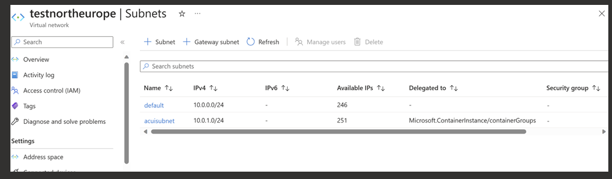
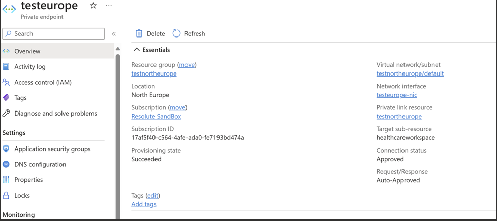
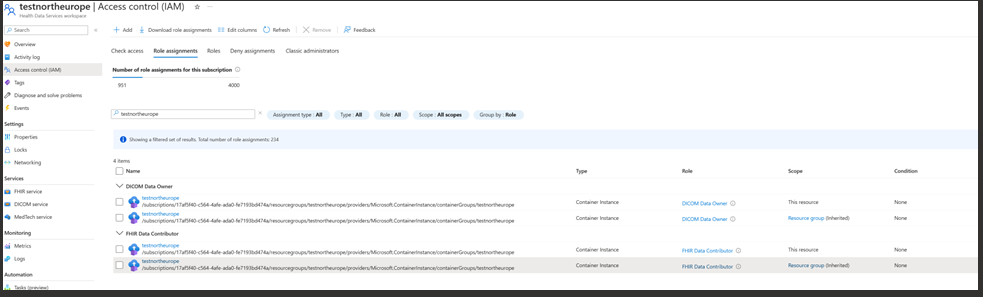
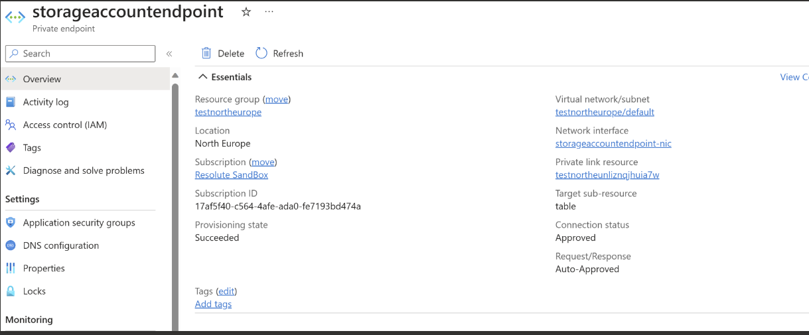

# Configuration steps for DICOM Cast to work with Private Link enabled DICOM

1. Create a Virtual Network with two subnets within the same subscription and region as you would plan to create the Health Data Services Workspace.
    1. Default subnet
    2. Subnet delegated to Microsoft.containerinstance/containergroups

2. Provision Health Data Services workspace, DICOM and FHIR in the same region.
3. Enable Private Link to Health Data Service Workspace. This Private Link would use the Virtual Network created in step 1 and default subnet

4. Use the template given [here](DicomcastDeploymentTemplate.md) to deploy DICOM Cast within a Virtual Network created in step 1. This will use the subnet that is delegated to Microsoft.containerinstance/containergroups as shown in picture in step 1. 
5. Add the following role assignments to Health Data Service Workspace on container instances System Assigned Managed Identity. 
    1. DICOM Data Owner 
    2. FHIR Data Contributor   

6. DICOM Cast needs to talk to table storage within the storage account for processing Change Feed. Enable Private Link to the storage account created as a part of template deployment in step 4. This Private Link should also be in same vnet and default subnet that is created in step 1. 

7. Disable public network access for the storage account (`Security + Networking` > `Networking` > `Firewalls and virtual networks` > `Public Network Acccess` > `Disabled`)

8. Ensure all the fields mentioned here are populated in the key vault provisioned in step 4. https://github.com/microsoft/dicom-server/blob/main/docs/how-to-guides/sync-dicom-metadata-to-fhir.md#update-key-vault-for-dicom-cast 

9. Restart DICOM Cast container. It should be running successfully. 

