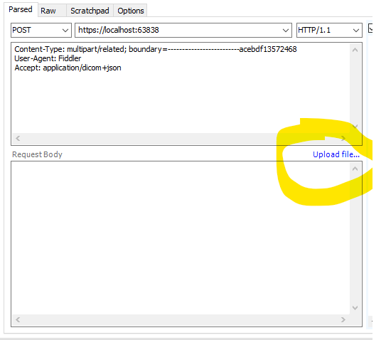

# Developing
## Requirements
- Azure storage emulator
- Sql Server 2019
- Visual Studio 2019

## Getting Started
- [Clone the dicom-server repo](https://github.com/microsoft/dicom-server.git)
- Navigate to the cloned dicom-server directory
- Open Microsoft.Health.Dicom.sln in VS

## To Develop
- Build
- Run all tests from the Test explorer

# Testing
- Make sure the storage emulator is running
- Set Microsoft.Health.Dicom.Web as your startup project
- Run the project
- Webserver is now running at https://localhost:63838/

## Fiddler to Post dcm files
- Install fiddler
- Go to Tools->Options->Https on fiddler. Click protocols and add "tls1.2" to the list of protocols.
- Use fiddler composer to post a request with (use upload file button at request body section as shown in picture below) 
   - Content-type: multipart/related
   - accept: application/dicom+json
   - multi-part Content-type: application/dicom



You should see the request body automatically populated as below.

```http
POST https://localhost:63838/studies/

Content-Type: multipart/related; boundary=-------------------------acebdf13572468
User-Agent: Fiddler
accept: application/dicom+json

---------------------------acebdf13572468
Content-Disposition: form-data; name="fieldNameHere"; filename="Slice1.dcm"
Content-Type: application/dicom

<@INCLUDE *C:\dicomfiles\Output\Study437_Series1\Slice1.dcm*@>
---------------------------acebdf13572468--

```
## Postman for Get
-  Check the [conformance](https://microsofthealth.visualstudio.com/Health/_git/health-paas-docs?path=%2Fspecs%2FDICOM%2FDICOMWeb-Conformance.md&_a=preview) document to try a WADO or QIDO url.
- Example QIDO to get all studies
```http
GET https://localhost:63838/studies
accept: application/dicom+json
```