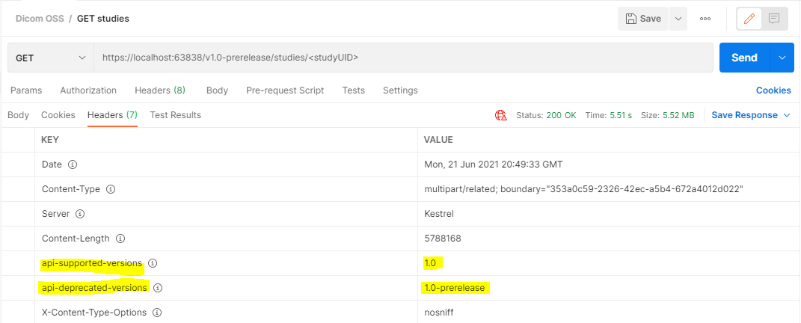

# API Versioning for Dicom Server

This guide gives an overview of the API versioning of the REST endpoints for Dicom Server.

## Routes

API Version number are set within the route. Example:
`/v1.0-prerelease/studies`

To add a route, use the `[VersionedRoute]` attribute to automatically add the version number to the route. Example:
```C#   
[HttpPost]
[VersionedRoute("studies")]
public async Task<IActionResult> PostAsync(string studyInstanceUid = null)
```

## Incrementing the version

We will only increment the major version of the API, and leave the minor version at 0. Ex: 1.0, 2.0, 3.0, etc.

The major version must be incremented if a breaking change is introduced.

List of things we will consider to be a breaking change
1. Renaming or removing endpoints
1. Removing parameters or adding mandatory parameters
1. Changing status code
1. Deleting property in response or altering response type at all (but okay to add properties to the response)
1. Changing the type of a property
1. Behavior of an API changes (changes in buisness logic, used to do foo, now does bar)

More info on breaking changes from the [REST guidelines](https://github.com/Microsoft/api-guidelines/blob/master/Guidelines.md#123-definition-of-a-breaking-change)

Additive changes are not considered breaking changes. For example, adding a response field or adding a new route.

Bug fixes are not considered breaking changes.

### Prerelease versions

Adding a version with the status "prerelease" is a good idea if you have breaking changes to add that are still prone to change, or are not production ready. 
Prerelease versions may experience breaking changes and are not recommended for customers to use in production environments.

`[ApiVersion("x.0-prerelease")]`

or

`ApiVersion prereleaseVersion = new ApiVersion(x, 0, "prerelease");`

### How to increment the version

1. Add a new controller to hold the endpoints for the new version, and annotate with `[ApiVersion("<desiredVersion>")]`. All existing endpoints must get the new version.
2. Mark the previous version as deprecated (see: [Deprecation](#Deprecation)). TODO: should we do this?
3. Add the new version number to `test/Microsoft.Health.Dicom.Web.Tests.E2E/Rest/VersionAPIData.cs` to test the new endpoints.
4. Test to verify the breaking changes were not added to the previous version(s).

## Headers

`ReportApiVersions` is turned on, which means we will return the headers `api-supported-versions` and `api-deprecated-versions` when appropriate.

- `api-supported-versions` will list which versions are supported for the requested API. It is only returned when calling an endpoint annotated with `[ApiVersion("<someVersion>")]`. 

- `api-deprecated-versions` will list which versions have been deprecated for the requested API. It is only returned when calling an endpoint annotated with `[ApiVersion("<someVersion>", Deprecated = true)]`.

Example:

```
[ApiVersion("1.0")]
[ApiVersion("1.0-prerelease", Deprecated = true)]
```



## Testing for breaking changes

TODO: Update with procedure on how we decide to test

## Deprecation

We can deprecate old versions by marking the version as deprecated as follows:
```c#
[ApiVersion("2.0")]
[ApiVersion("1.0", Deprecated = true)]
```

TODO: Does microsoft have hard rules on how long we need to maintain a version before we can complete it?

ex: MS Graph https://docs.microsoft.com/en-us/graph/versioning-and-support

https://docs.microsoft.com/en-us/lifecycle/policies/modern

https://docs.microsoft.com/en-us/lifecycle/products/microsoft-cloud-for-healthcare Is this us?

### When should I deprecate a past version?

x years after the +1 version has been released. TODO: How many years? Ex: MS Graph does it immediately after +1 release

### When should I delete the code for a deprecated version?

x years after deprecation, and we can confirm by viewing the logs that the deprecated version is no long being referenced by any customers. TODO: How many years? Ex: MS Graph does is 2 years after deprecation. Modern policy minimum is 12 months.
If the version is still in use by customers, we will need to reach out to them to get them to move to the newest version. Customers must be given at least 30 days notice before we take distruptive action.

## Communicating changes to customers

TODO: figure out if we need to add process for developers to document their changes for customers