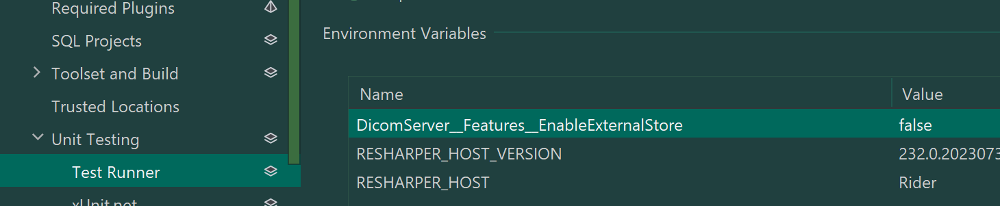

# Functions

We utilize "functions" to offload work to the background. This is useful when work does not need to be transactional
and completed right away. Instances of this are updating or deleting files.

To do the work, we utilize [Durable Functions](https://learn.microsoft.com/en-us/azure/azure-functions/durable/) which is an extension of Azure Functions that lets you write stateful functions in a serverless compute environment.

## Breaking Changes
There are several examples of breaking changes to be aware of and examples with how to handle these can be found
[here](https://learn.microsoft.com/en-us/azure/azure-functions/durable/durable-functions-versioning?tabs=csharp#how-to-handle-breaking-changes).

The specific strategy using in this repo to version functions is by updating the version name within the function
name, known as [side-by-side deployment](https://learn.microsoft.com/en-us/azure/azure-functions/durable/durable-functions-versioning?tabs=csharp#side-by-side-deployments).

Upon deploying new code with new function versions, it is possible that the function state retained for an
ongoing/running function will be that of a previous version. Because of this, we need to be aware of backwards
compatibility and breaking changes.

Always keep in mind that the state of a function for orchestration is kept in JSON and de/serialization has to be
able to occur back and forth. Often, to avoid unnecessary complexity, it is easier to version the functions and
even orchestration than to attempt to write tests to ensure everything would continue to work with changes made.

Also, be sure to clean up the "old" functions quickly after the new ones are released so we do not have stale code.

## Common Gotchas

When versioning a function because input arguments have changed, pay attention to the CTOR of the arg and ensure the
field names are equivalent to the properties they are being assigned to. Without doing this, the JSON de/serializer
for the functions host will not understand how to de/serialize the parameters to the CTOR and you may see *null
assigned to a parameter that was otherwise seemingly passed in and non null*.

## host.json
You'll see that we have some duplication between host.json and the webserver's appsettings. When testing locally, be
sure to set all of the values you'll need so the local host knows how to utilize these features.

## Testing Locally

Whether using E2E tests or running the web server, by default the Azure emulator running locally will be used to
store state. If a function fails, it may be necessary to go in to manually cleanup this state by deleting the
DicomTaskHubInstances and DicomTaskHubHistory tables in the Azure Storage Explorer.

Note that enabling the External Store for IDP just means the dcm file blob will be written externally. All function
fata will continue to be written to the default local store.
If enabling External Store, be sure to also run the test with the flag set:
dotnet test "Microsoft.Health.Dicom.Web.Tests.E2E.dll" --filter "Category=bvt-dp" -e DicomServer__Features__EnableExternalStore="true"

Often, this flag can also be set in your IDE. For example:

### E2E tests

Run E2E tests and place debug points throughout the function code to step through the code.

### Making a request to the server to activate a function

To test locally, you'll want to have two separate IDE windows open:
1. one to run the web server
2. one to run the function host

This way, you can make a request via Postman or curl to the web server and the function host will pick up the request.
This will allow you to debug and step through the function code. This is the closest we have to testing a full
integration locally aside from using E2E tests.

## Build Failures
If there's build failures due to a function failing, you can check out the Application Insights app for logs to
discern the cause. Do not ignore these. These should never be flaky and if any are, fix them.
