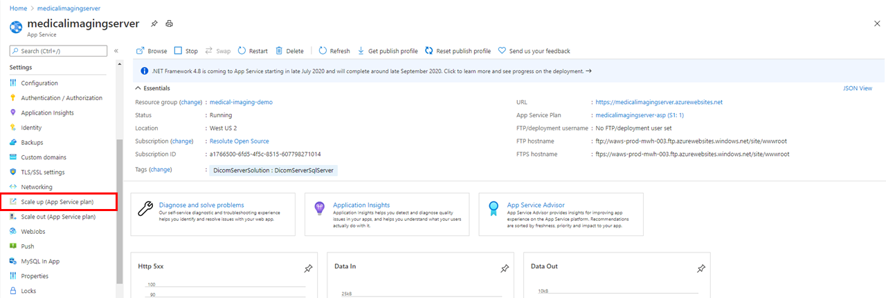
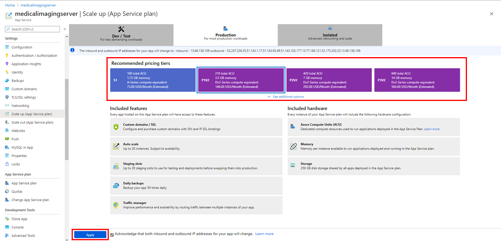
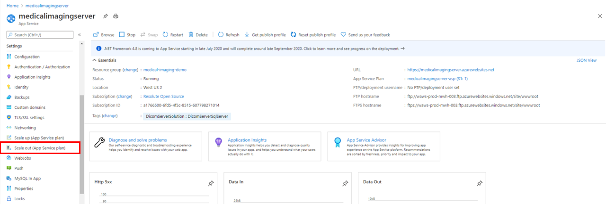
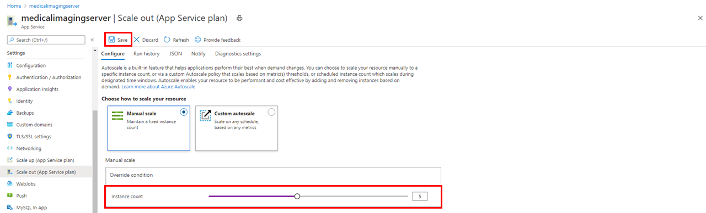
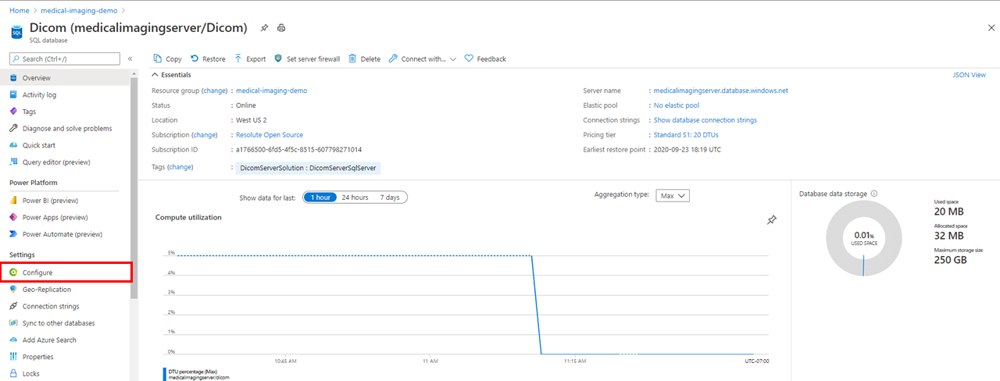
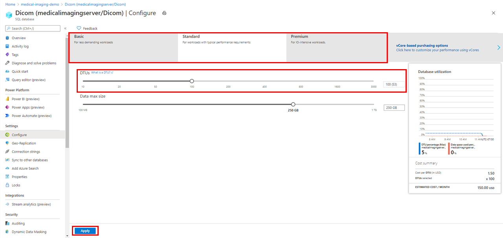
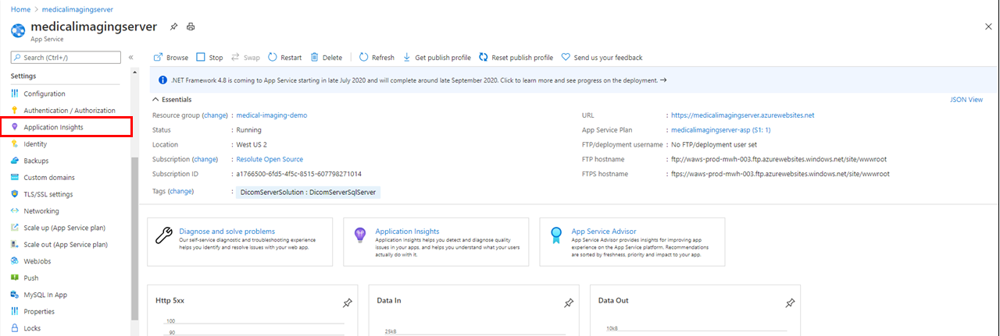
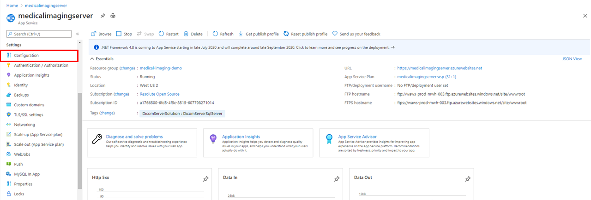
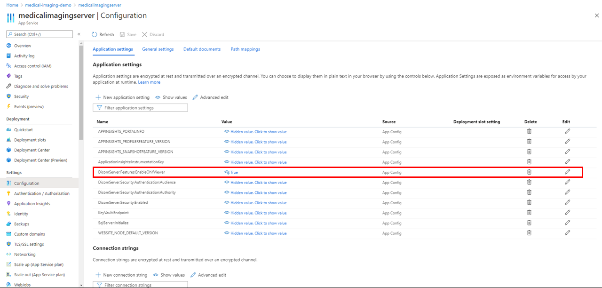

# Configure Medical Imaging Server for DICOM Settings

This How-to Guide explains how to configure settings for the Medical Imaging Server for DICOM after deployment.

## Prerequisites

To configure your Medical Imaging Server for DICOM, you need to have an instance deployed. If you have not already deployed the Medical Imaging Server, [deploy an instance to Azure](../quickstarts/deploy-via-azure.md).

## Manage Authentication

To configure authentication for the Medical Imaging Server for DICOM using Azure AD, see [Enable Authentication with Tokens](../how-to-guides/enable-authentication-with-tokens.md).

To manage authentication in development and test scenarios without AAD integration using an Identity Provider, see [Identity Server Authentication](../development/identity-server-authentication.md).

## Manage Azure App Service

The S1 tier is the default App Service Plan SKU enabled upon deployment. Azure offers a variety of plans to meet your workload requirements. To learn more about the various plans, view the [App Service pricing](https://azure.microsoft.com/pricing/details/app-service/windows/).

If you would like to Scale Up your App Service plan to a different tier:

1. Navigate to your Medical Imaging Server for DICOM **App Service** in the Azure Portal.
1. Select **Scale up (App Service plan)** from the menu:

1. Select the plan that fits your workload requirements:

1. Click **Apply**.

Autoscale is a built-in feature that helps applications perform their best when demand changes. You can choose to scale your resource manually to a specific instance count, or via a custom Autoscale policy that scales based on metric(s) thresholds, or scheduled instance count which scales during designated time windows. Autoscale enables your resource to be performant and cost effective by adding and removing instances based on demand

In addition to Scale Up, you can also Scale Out your App Service Plan to meet the requirements of your workload. You can select to manually scale your service to maintain a fixed instance count, or custom autoscale your service based on any metrics. If you would like to Scale Out your App Service Plan:

1. Navigate to your Medical Imaging Server for DICOM **App Service** in the Azure Portal.
1. Select **Scale out (App Service plan)** from the menu:

1. Choose the Scale Out option that best fits your requirements:

1. Select **Save**.

## Manage SQL Database

The Standard tier of the DTU-based SQL performance tiers is enabled by default upon deployment. In DTU-based SQL purchase models, a fixed set of resources is assigned to the database via performance tiers: Basic, Standard and Premium. To learn more about the various tiers, view the [Azure SQL Database Pricing](https://azure.microsoft.com/pricing/details/sql-database/single/).

If you would like to update your SQL Database tier:

1. Navigate to the **SQL Database** you created when you deployed the Medical Imaging Server for DICOM.
1. Select **Configure**:

1. Choose the performance tier and DTU level that meets your workload requirements:

1. Click **Apply**.

## Additional Configuration Settings

**Application Insights**: By default, Application Insights is deployed, but not enabled, when you deploy the Medical Imaging Server for DICOM to Azure. To update this setting, navigate to your App Service:

1. Select **Application Insights** from the menu:

1. Select **Turn on Application Insights**:

**OHIF Viewer**: By default, OHIF Viewer is enabled when you deploy the Medical Imaging Server for DICOM to Azure. To update this setting:

1. Navigate to your Medical Imaging Server for DICOM **App Service** in the Azure Portal.
1. Select **Configuration** from the menu:

1. Select the *Edit* button for **DicomServer:Features:EnableOhifViewer**:

1. Update the **Value** to *False* and select **Ok**.
1. Click **Save** to update the setting.

## Summary

This How-to Guide explained how to configure settings for the Medical Imaging Server for DICOM after deployment. Once your Medical Imaging Server for DICOM is deployed and configured, you can [Use Medical Imaging Server for DICOM APIs](../tutorials/use-the-medical-imaging-server-apis.md).
