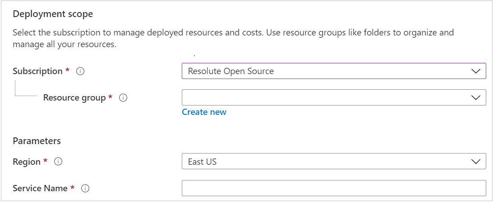

# Deploy the Medical Imaging Server for DICOM using the Azure portal

In this quickstart, you'll learn how to deploy the Medical Imaging Server for DICOM using the Azure portal.

If you do not have an Azure subscription, create a [free account](https://azure.microsoft.com/free) before you begin.

Once you have your subscription, click the link below to begin deployment.

<a href="https://portal.azure.com/#create/Microsoft.Template/uri/https%3A%2F%2Fdcmcistorage.blob.core.windows.net%2Fcibuild%2Fdefault-azuredeploy.json" target="_blank">
    
</a>

## Enter account details

1. Select your Azure subscription.
1. Select an existing resource group or create a new one.
1. Select the region to deploy your Medical Imaging Server for DICOM.
1. Select a Service Name for your deployment. Note that the Service Name will be included in the URL you will use to access the application.



## Configure deployment settings

Configure the remaining deployment settings for your Medical Imaging Server. The default settings are appropriate for an excellent dev/test or proof-of-concept environment as they are inexpensive, yet perform well for small to medium loads. For a production environment, upgrading to regionally redundant storage, failover databases and autoscaling application servers is recommended.

Refer to [Configure Medical Imaging Server for DICOM](../how-to-guides/configure-dicom-server-settings.md) for more configuration instructions.

> NOTE: Refer to the [SQL Server Password Complexity Requirements](https://docs.microsoft.com/sql/relational-databases/security/password-policy?view=sql-server-ver15
) when setting your SQL admin password.

## Summary

In this quickstart, you learned how to deploy and configure the Medical Imaging Server for DICOM using the Azure portal.

Once deployment is complete, you can use the Azure Portal to navigate to the newly created App Service to see the details. The default URL to access your Medical Imaging Server for DICOM  will be: ```https://<SERVICE NAME>.azurewebsites.net```

To get started using your newly deployed Medical Imaging Server for DICOM, refer to the following documents:

* [Configure Medical Imaging Server for DICOM](../how-to-guides/configure-dicom-server-settings.md)
* [Use Medical Imaging Server for DICOM APIs](../tutorials/use-the-medical-imaging-server-apis.md)
* [Upload DICOM files via the Electron Tool](../../tools/dicom-web-electron)
* [Enable Azure AD Authentication](../how-to-guides/enable-authentication-with-tokens.md)
