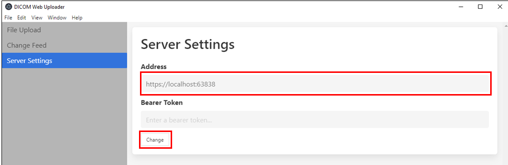
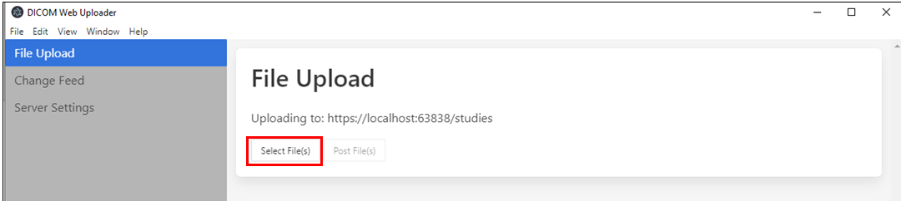

# DICOM Web Electron
This tool is an Electron application used to interact with your DICOM server. It currently has the ability to upload one or many `.dcm` files to a given server.

## Prerequisites
To use the DICOM Electron tool, install the latest version of Node JS. The installer is available at [https://nodejs.org/en/download/](https://nodejs.org/en/download/).

## Getting Started
Once Node JS is installed, run the following commands in a Terminal window to launch the DICOM web electron tool:

1. Run `npm install`
2. Run `npm start`

Once the Electron Tool launches, navigate to Server Settings. Select 'Change' to update the address of your DICOM Server.

**NOTE**: If you deployed the DICOM Server through Azure, you can find the URL on the Overview page of the App Service.



**NOTE**: If you have enabled Authentication settings, you can access your Bearer Token using the Azure CLI. Instructions are available here for a similar resource:

- [Access Token with Azure CLI](https://docs.microsoft.com/en-us/azure/healthcare-apis/get-healthcare-apis-access-token-cli)

## Upload DICOM files to your server
To upload files stored locally on your device, click 'Select File(s)'. You can upload multiple DICOM files at once to your server.



## Change Feed
The change feed offers the ability to go through the history of the DICOM server and act upon the creates and deletes in the service. Learn more about Change Feed here:
- [DICOM Change Feed](microsoft/dicom-server/blob/master/docs/users/ChangeFeed.md)

Navigate to Change Feed to update the Offset value, which is the number of records to skip before the values to return.

## Packaging
The application is packed with [`electron-builder`](https://www.electron.build/)

To package the application you can run the following command

```
electron-builder build --win
```